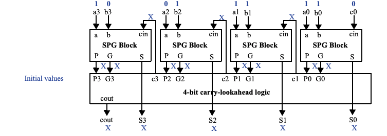

## (5 pts)
Perform two-level logic size optimization for F(a,b,c) = ab'c + abc + a'bc + abc' using (a) algebraic methods, (b) a K-map. Express the answers in sum-of-products form.

## (5 pts)
Perform two-level logic size optimization for F(a,b,c,d) = a'bc'd + ab'cd', assuming that a and b can never both be 1 at the same time, and that c and d can never both be 1 at the same time (i.e., there are don’t cares). 

## (5 pts)
Use repeated application of the expand operation to heuristically minimize the equation F(a,b,c) = a'b'c + a'bc + abc. (a) Try expanding each term for each variable. (b) Instead, determine a way to randomly choose an expand operation, and then apply 5 random expands.

## (5 pts)
Compare the logic size (number of gate inputs) and the delay (number of gatedelays) of a minimal bitwidth state encoding versus an output encoding for the laser-based distance measurer FSM in week 11's slides.

## (5 pts)
Trace the execution of the 4-bit carry-lookahead adder shown in Figure 6.57 when a = 11 (eleven) and b = 7. Show all the input and output values of the SPG blocks and of the carry-lookahead block initially and after each relevant number of gate delays.

> 

## (5 pts)
(a) Design a 64-bit hierarchical carry-lookahead adder using 4-bit carry-lookahead adders. (b) What is the total delay through the 64-bit adder? (c) What is the speedup of the carry-lookahead adder compared to a 64-bit carry-ripple adder; compute speedup as (slower time)/(faster time). 

## (5 
Design a 24-bit hierarchical carry-lookahead adder using 4-bit carry-lookahead adders.
